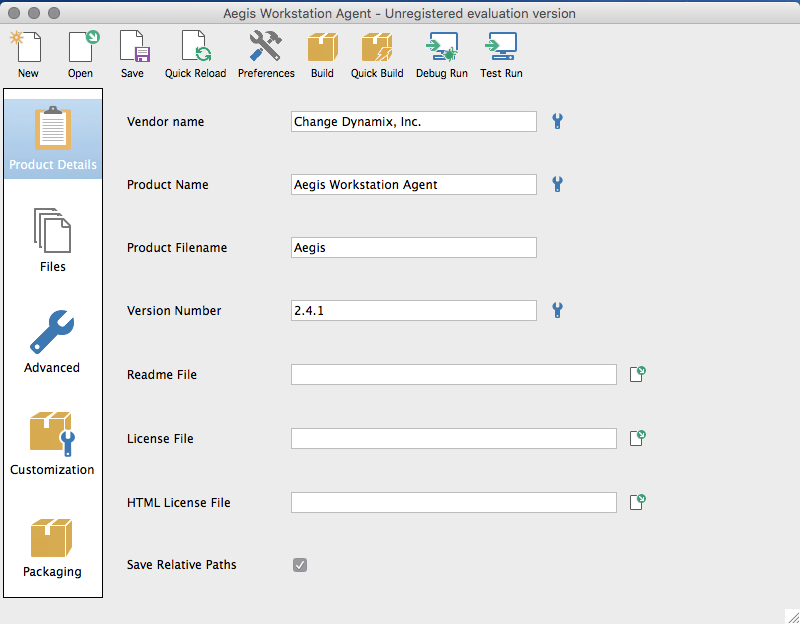
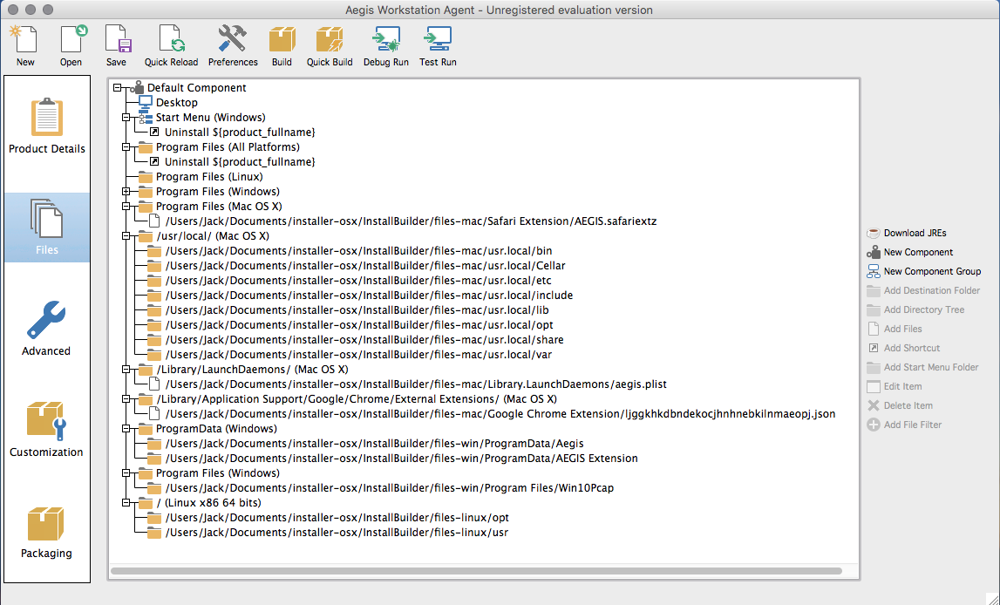
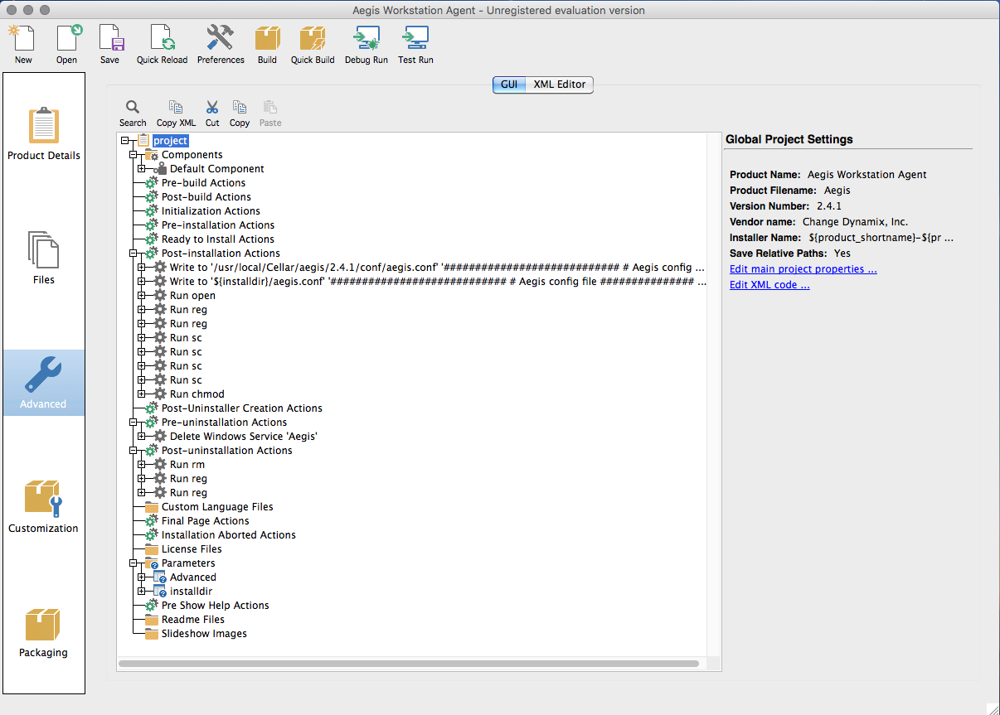

AEGIS installer for OS X, Windows and Linux
-------------------------------------------

Launch InstallBuilder.

In the InstallBuilder main menu select File -> Open Project -> From File...

Select Aegis.xml

Project will be loaded.

In the left column you will see five main project tabs.

In the "Product Details" tab you can setup the package information like product name, product version, vendor name etc.

In the "Files" tab you can set up the project files destination paths.

OS X:

    Aegis files must be installed in /usr/local/

    Startup Aegis plist file must be installed in /Library/LaunchDaemons/

    "Aegis Google Chrome extension" json file must be installed in /Library/Application Support/Google/Chrome/External Extensions/

    "Aegis Safari extension" file must be installed in Program Files (Mac OS X)

    "Aegis Mozilla Firefox extension" file must be installed in /Applications/Firefox.app/Contents/Resources/browser/extensions/

WINDOWS:

    Aegis files must be installed in "Program Files (Windows)" and "ProgramData (Windows)"

    "Aegis Mozilla Firefox extension" file must be installed in /Program Files/Mozilla Firefox/browser/extensions

LINUX:
    
    Aegis files must be installed in the root of filesystem (/usr directory)

    "Aegis Google Chrome extension" json file must be installed in the root of filesystem (/opt directory)

    "Aegis Mozilla Firefox extension" file must be installed in /usr/lib/firefox-addons/extensions

"Advanced" tab allows you to create menu with the installations parameters and custom scripts.

Select "Post-installation Actions" to edit the installer scripts. There are:

    - scripts to update Aegis config file (Windows and OS X)

    - script to install Aegis Safari extension (OS X)

    - script to install Aegis Google Chrome extension (Windows)

    - script to install Aegis Internet Explorer extension (Windows)    

    - script to create and run Aegis service (Windows)

    - script to make aegis file executable (Lunix)

Select "Post-uninstallation Actions" to edit the uninstaller scripts. There are:

    - script to uninstall Aegis Safari extension (OS X)

    - script to uninstall Aegis Google Chrome extension (Windows)

    - script to uninstall Aegis Internet Explorer extension (Windows)

Select "Advanced" in the "Parameters" folder to edit Aegis configuration menu.

After all actions will be done click "Build" in the InstallBuilder main menu.

After a successful build the installation package will be located in "/Applications/BitRock InstallBuilder/output/" folder.
