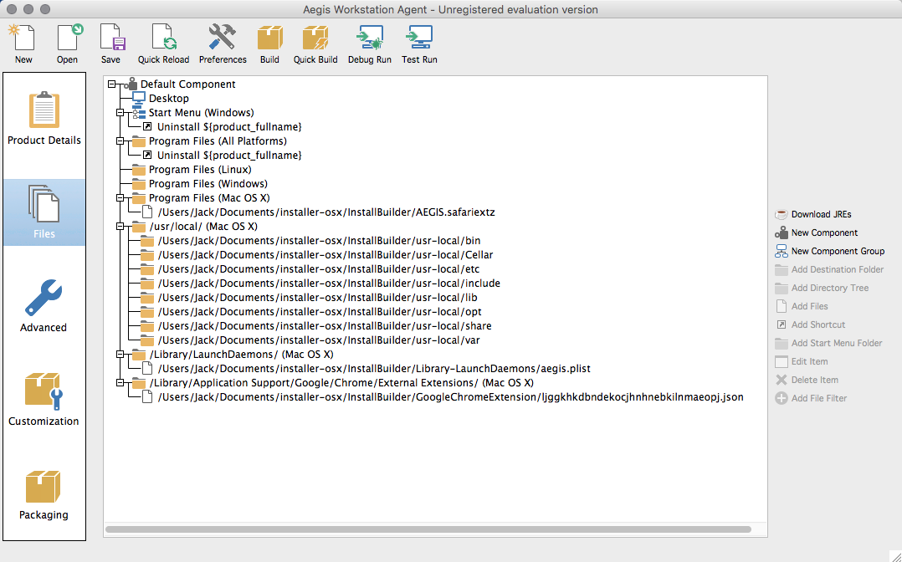
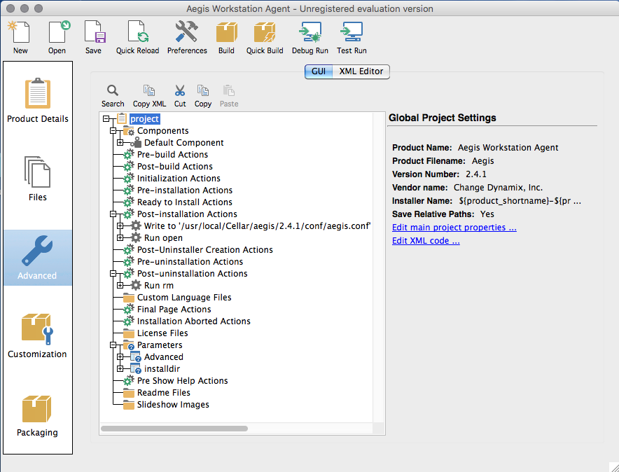

QUICK START TO BitRock InstallBuilder
-------------------------------------

Launch InstallBuilder.

In the InstallBuilder main menu select File -> Open Project -> From File...

Select Aegis.xml

Project will be loaded.

In the left column you will see five main project tabs.

In the "Product Details" tab you can setup all package information like product name, product version, vendor name etc.

In the "Files" tab you can set up project files destination paths.

Aegis files must be installed in /usr/local/

Startup aegis plist file must be installed in /Library/LaunchDaemons/

To install Aegis Google Chrome extension json file must be located in /Library/Application Support/Google/Chrome/External Extensions/

"Advanced" tab allows you to create menu with installations parameters. Select "Parameters" folder to edit it.

After all files will be placed click "Build" in the InstallBuilder main menu.

After a successful build installation package will be located in "/Applications/BitRock InstallBuilder/output/" folder.
