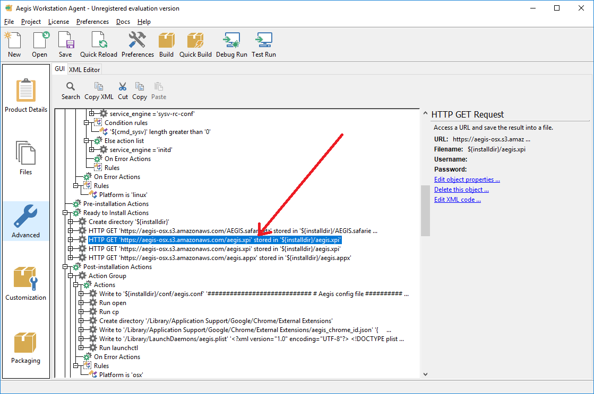
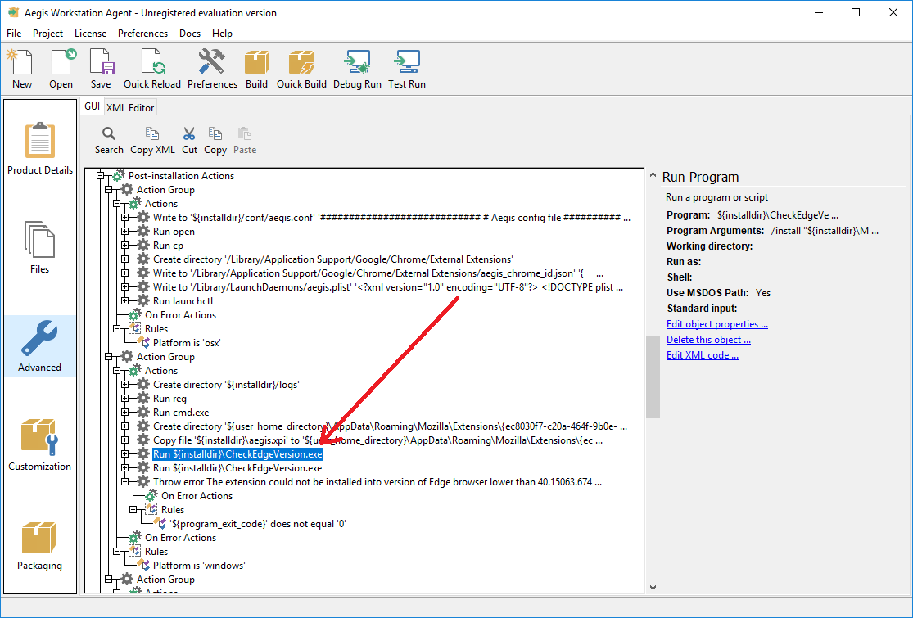

AEGIS installer for OS X, Windows and Linux
-------------------------------------------

Launch InstallBuilder.

In the InstallBuilder main menu select File -> Open Project -> From File...

Select Aegis.xml

Project will be loaded.

In the left column you will see five main project tabs.

In the "Product Details" tab you can setup the package information like product name, product version, vendor name etc.

In the "Files" tab you can set up the project files destination paths.

OS X:

    Aegis files (usr-local.zip) must be installed in Program Files (Mac OS X). It's archive of /usr/local/ directory, which will be unzipped in Post-installation Actions

    "Aegis Safari extension" file must be installed in Program Files (Mac OS X)

    "Aegis Google Chrome extension" json file must be installed in /Library/Application Support/Google/Chrome/External Extensions/

    "Aegis Mozilla Firefox extension" file must be installed in /Applications/Firefox.app/Contents/Resources/browser/extensions/

WINDOWS:

    Aegis files must be installed in "Program Files (Windows)" and "ProgramData (Windows)"

    "Aegis Mozilla Firefox extension" file must be installed in %APPDATA%\Mozilla\Extensions
    
    "Aegis Edge extension" must be installed in "Program Files (Windows)" and "ProgramData (Windows)"

LINUX:
    
    Aegis files must be installed in the root of filesystem (/usr directory)

    "Aegis Google Chrome extension" json file must be installed in the root of filesystem (/opt directory)

    "Aegis Mozilla Firefox extension" file must be installed in /usr/lib/firefox-addons/extensions

"Advanced" tab allows you to create menu with the installations parameters and custom scripts.

Select "Post-installation Actions" to edit the installer scripts. There are:

    - script to unzip Aegis files (usr-local.zip) to /usr/local (OS X)

    - scripts to update Aegis config file (Windows and OS X)

    - script to create and run Aegis service (OS X)

    - script to install Aegis Safari extension (OS X)

    - script to install Aegis Google Chrome extension (Windows)

    - script to install Aegis Internet Explorer extension (Windows)    
    
    - script to install Aegis Edge extension (Windows)    

    - script to create and run Aegis service (Windows)

    - script to make aegis file executable (Lunix)

Select "Post-uninstallation Actions" to edit the uninstaller scripts. There are:

    - scripts to stop and remove Aegis service (OS X)

    - scripts to uninstall Aegis files (OS X)

    - script to uninstall Aegis Safari extension (OS X)

    - script to uninstall Aegis Google Chrome extension (Windows)

    - script to uninstall Aegis Internet Explorer extension (Windows)

Select "Advanced" in the "Parameters" folder to edit Aegis configuration menu.

After all actions will be done click "Build" in the InstallBuilder main menu.

After a successful build the installation package will be located in "/Applications/BitRock InstallBuilder/output/" folder.

Below is the instructions on how to modify the source code of installer for installation of plugins. Screenshot are provided.

After the “extensions” are published in the stores, the installers may be edited.

First, clone the git repository at:
https://github.com/SageAxcess/installer-osx.git
Then, select the branch dev_2017

Now, editing can begin. We will show an example of the installation of adblock extension, because it is already present in all of the shops. Your plugins will be installed in a similar way.

1) Run InstallBuilder and, using in File-> Open Project-> From file, select the project file named Aegis.xml, located in the previously cloned directory, at installer-osx\InstallBuilder\Aegis.xml.

2) Select Advanced section on InstallBuilder side panel

3) Scroll down the settings tree and locate the element named "Ready to Install Actions". 

Tree elements that need to be edited are outlined with the red rectangle.

Prior to editing, download the published extensions from the stores.

## Safari

In your case, there is no need to download safari extension, because you already have it. (The one we provided earlier). You will need to have it on the server at 
https://aegis-osx.s3.amazonaws.com/AEGIS.safariextz

Chrome
There is no need to download the plugin for Chrome, instead, go to https://chrome.google.com/webstore/category/extensions in the Chrome browser.

Search for the “extension” in the store and select it. You should be able to see the page similar to the one on the screenshot (screenshot contains the adblock example page). 

Next, in the address bar, copy your extension’s guid (in this example it is underlined with a red line, gighmmpiobklfepjocnamgkkbiglidom). Now you have everything for installing Chrome “extension”.

## Firefox
Prior to downloading the “extension” for Firefox, open the following folder:

 C:\Users\<your username>\AppData\Roaming\Mozilla\Firefox\Profiles\<random name>\extensions

This folder contains all the “extensions” installed. If the folder is not empty, you will need to take note of all extensions contained in it, in order to determine which of the extensions is yours after you have installed it. The one which will appear after the installation and was not in the folder before the installation, is your extension.

In order to download the “extension” for Firefox, use the following link, https://addons.mozilla.org/en-US/firefox/. Then, in the Firefox store, find your extension and install it.

Now, in the folder  C:\Users\<your username>\AppData\Roaming\Mozilla\Firefox\Profiles\<random name>\extensions, search for "<your extension>.xpi". (see the screenshot based on the adblock example).

In case of adblock, it will be the file "{d10d0bf8-f5b5-c8b4-a8b2-2b9879e08c5d}.xpi". 

You will need to place this file "<your extension>.xpi" to your server here: https://aegis-osx.s3.amazonaws.com/<your extension>.xpi (In the adblock example, it will be https://aegis-osx.s3.amazonaws.com/{d10d0bf8-f5b5-c8b4-a8b2-2b9879e08c5d}.xpi)
Now, you have everything for the installation of Firefox “extension”.

## Edge

In order to download the plugin, you will need to download the program named Fiddler.
To start, download Fiddler (https://www.telerik.com/fiddler) from its official site and install it like any other Windows Software.
By default, Windows won’t allow apps to send network traffic to the local computer, so we first need to remove this restriction. To do that, open Fiddler by searching for it in the Start menu.
Once opened, click on the “WinConfig” button appearing on the top of the navigation bar.

The above action will open the “AppContainer Loopback Exemption Utility” window. Here, click on the button “Exempt All,” and then click on the “Save Changes” button. Once you are done, close this window.

On the main window, click on the “Remove” icon and select the option “Remove all” from the drop-down menu. This action will clear the capture screen.

Now open the Windows Store, find the app you want to download and click on the “Get” button. In my case, I’m trying to download the adblock app. This is a win32 application converted to a UWP app.

Once Windows acquires the license and starts the download process, this is how it looks in the Windows Store. Once you see this, proceed to the next step.

Since Fiddler is running in the background, all the traffic is being monitored by it. From the monitoring results we can find and copy the URL to download the appx package. To do that, click on the “Find” button appearing in the top navigation bar.

In the Find window type “appx” in the empty field, and press the Enter button.

The above action will highlight all the URLs that are responsible for downloading the appx package. From the highlighted URLs, find and right-click on the first URL and select the option “Copy > Just URL.” While doing this, make sure that highlighted URL has the status code 200.

Once the URL has been copied, simply paste it into your favorite browser’s address bar, and press the Enter button. The appx package should be downloaded automatically. Depending on the download size, it may take some time, but you should have the file in your Downloads folder as soon as the download is complete.

After you have finished downloading the plugin (in our case, EyeoGmbH.AdblockPlus_0.9.9.0_neutral__d55gg7py3s0m0.Appx), the file "<your extension>.appx" must be place on your server at https://aegis-osx.s3.amazonaws.com/<your extension>.appx (In the adblock example, it will be https://aegis-osx.s3.amazonaws.com/ EyeoGmbH.AdblockPlus_0.9.9.0_neutral__d55gg7py3s0m0.Appx) 
Now you have everything to install the Edge “extension”.

4) Specify the links from which the extensions will be downloaded in InstallBuilder.

## Safari:
For Safary, double click on the element shown in the screenshot below:

The following dialog box will open.

Enter the link to your safari extension, which you have uploaded to the server earlier, into the field outlined with the red rectangle and click “OK”. 

## Firefox:

For Firefox, double click on the element shown in the screenshot below

The following dialog box will open

Enter the link to your Firefox extension, which you have uploaded to the server earlier, into the field outlined with the red rectangle and click “OK”. 

Next, double click on the element shown on the screenshot below

The following dialog box will open

Enter the link to your Firefox extension, which you have uploaded to the server earlier, into the field outlined with the red rectangle and click “OK”. 

Double click on the field shown in the screenshot below

The following dialog box will open:

Enter the link to your Edge extension, which you have uploaded to the server earlier, into the field in the red rectangle and click “OK”. 

In the Filename field in the red rectangle, the text ${installdir}/aegis.appx needs to be edited

Replace aegis.appx with the name of you extension, in our case, the text will look like this ${installdir}/EyeoGmbH.AdblockPlus_0.9.9.0_neutral__d55gg7py3s0m0.Appx

Click “OK” once done.

5) Next, you will need to edit Post-installation Actions sections

## OSX

First, edit installation section for OSX, this section is outlined with the red rectangle on the screenshot below.

Double click on “Run cp” element.

The following dialog box will open:

You will need to edit “Program Arguments” field. In it, aegis.xpi text needs to be replaced with the name of the Firefox “extension” you have downloaded from Firefox store.

-f ${installdir}/aegis.xpi /Applications/Firefox.app/Contents/Resources/browser/extensions/<name of your Firefox extension downloaded from the store>.xpi

In our Adblock example, the text will look like this:
-f ${installdir}/aegis.xpi /Applications/Firefox.app/Contents/Resources/browser/extensions/{d10d0bf8-f5b5-c8b4-a8b2-2b9879e08c5d}.xpi

Click “OK” after editing.

Double click on the field shown on the screenshot.

The following dialog box will open:

You will need to edit “Path” field outlined with the red rectangle. The following string needs to be modified:

/Library/Application Support/Google/Chrome/External Extensions/aegis_chrome_id.json

Change aegis_chrome_id substring to guid of your Chrome extension.

In our adblock example, guid looks like this “gighmmpiobklfepjocnamgkkbiglidom” (how to get it is described above in section 3). The example of such string for adblock

/Library/Application Support/Google/Chrome/External Extensions/ gighmmpiobklfepjocnamgkkbiglidom.json

Click “OK” once done.

## Windows

Double click on the field shown on the screenshot below

The following dialog box will open:

“Destination” field, outlined with the red rectangle, needs to be edited. The string in it needs to be changed, so that aegis.xpi is replaced with the name of Firefox “extension” you have downloaded from the Firefox store.

${user_home_directory}\AppData\Roaming\Mozilla\Extensions\{ec8030f7-c20a-464f-9b0e-13a3a9e97384}\<name of your Firefox extension downloaded from the store >.xpi

In the Adblock exmpale, the string will look like this:
${user_home_directory}\AppData\Roaming\Mozilla\Extensions\{ec8030f7-c20a-464f-9b0e-13a3a9e97384}\{d10d0bf8-f5b5-c8b4-a8b2-2b9879e08c5d}.xpi

Click “OK” once done.

Double click on the field shown on the screenshot.

The dialog window will open:

The field “Program Arguments” in the red rectangle needs to be edited. The following string must be edited:

/C reg -command add HKEY_LOCAL_MACHINE\Software\Wow6432Node\Google\Chrome\Extensions\aegix_chrome_id /v update_url /d https://clients2.google.com/service/update2/crx /f

Replace aegix_chrome_id substring with the guid of your Chrome extension.

In the adblock example, guid looks like this “gighmmpiobklfepjocnamgkkbiglidom” (how to get it is described above in section 3). The example of such string for adblock

/C reg -command add HKEY_LOCAL_MACHINE\Software\Wow6432Node\Google\Chrome\Extensions\ gighmmpiobklfepjocnamgkkbiglidom /v update_url /d https://clients2.google.com/service/update2/crx /f

Click “OK” once done.

Double click on the field shown on the screenshot

The following dialog window will open:

“Program Arguments” field, outlined with the red rectangle, needs to be edited. The following string in it needs to be changed:
:
/C powershell -command "& {&'Add-AppxPackage' '${installdir}\aegis.appx'}"

Change aegis.appx substring to the name of Edge extension download previously.

The example of such string for adblock
/C powershell -command "& {&'Add-AppxPackage' '${installdir}\EyeoGmbH.AdblockPlus_0.9.9.0_neutral__d55gg7py3s0m0.Appx'}"

Click “OK” once done.

6) To build the installer, click on the “Build” button as shown on the screenshot

After the build process is finished, you will find your installer at the path shown on the screenshot

The installer path will be different in the building process for OSX, however it will be displayed in place of the Windows path on the screenshot above.

Since Edge extensions can only be installed from the store, when installing on a clean computer, the extension will be installed, but not displayed in the list of browser extensions. However, if the extension has already been installed in Edge and was removed, it will appear in the list of browser extension after the installation.

