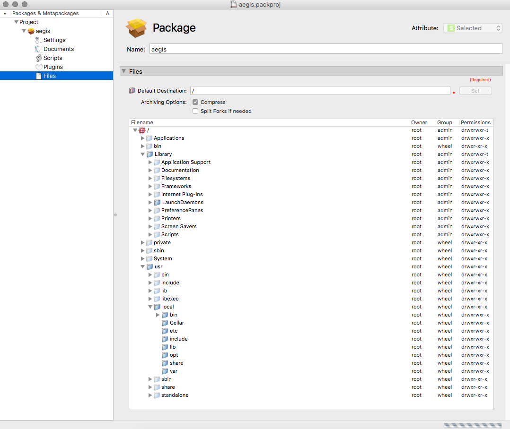
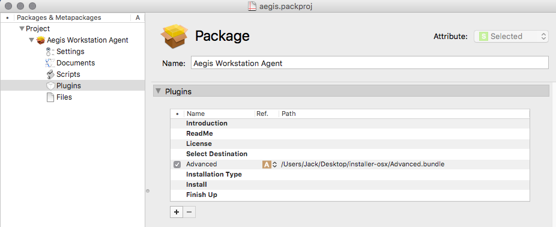
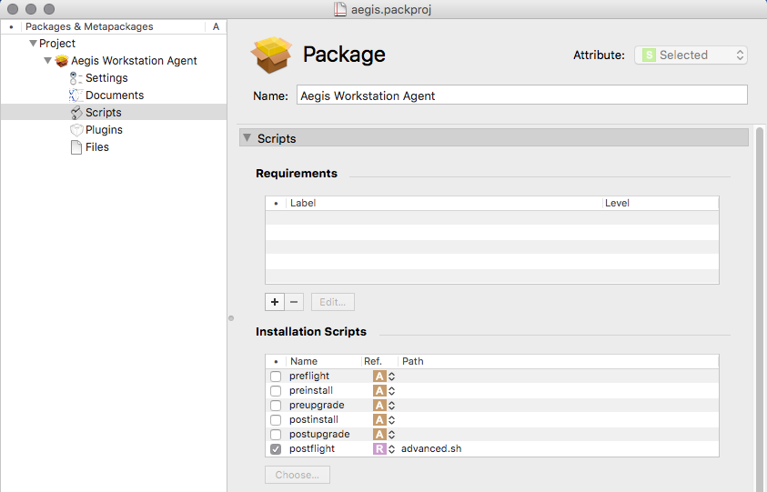

About Iceberg
-------------

Iceberg is an Integrated Packaging Environment (IPE) that allows you to create packages or metapackages conforming to the Mac OS X specifications. With Iceberg, you can quickly create your installation packages using a graphic user interface similar to your favorite development tools.

QUICK START
-----------

Run Iceberg-1.3.1.dmg

Select Iceberg.mpkg and intall it to your mac.

Launch Iceberg.

In the Iceberg main menu select File -> New Project...

In the appeared window select Darwin Package. Click Next.

Enter Project Name and Project Directory. Click Finish.

New window will be shown.

In the left columt select your project. Here you can change all package information as you want.

The main important for us is Files submenu.

You will see the default hierarchy of unix filesystem.

Do right click on /usr/local/ folder. Select "Add files..."

Add all Aegis folders and files that Homebrew installed to /usr/local/: bin, Cellar, etc, include, lib, opt, share, var.

To setup autostart plist files put them to /Library/LaunchDaemons/

You may need to create LaunchDaemons folder.

Go to Plugins menu and add "Advanced.bundle" file to the list.

Go to Scripts menu. 

Select "postflight" checkbox in the "Installation Scripts" submenu.

Click "Choose..." button and add "Advanced.sh" file to the list.

After all files will be placed go to Iceberg main menu Build -> Build

After a successful build installation package will be stored in your project directory in the build folder.

